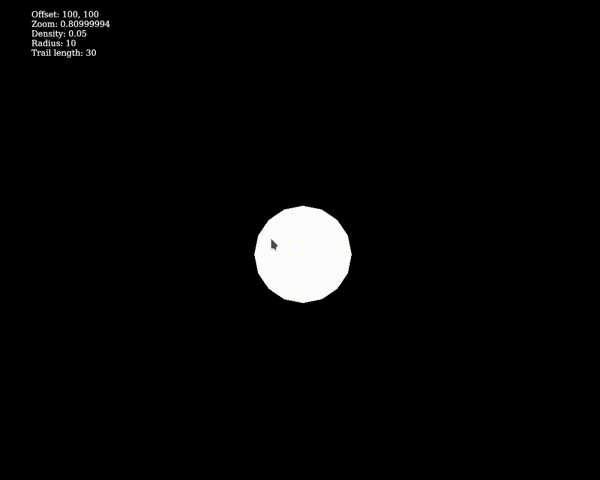

# nbody-rs
N body gravity sim with rust and ggez, made to learn rust




## Controls

Arrow keys to move

Scroll to zoom in/out

Q/A to increase/decrease radius of next placed body

W/S to increase/decrease density (try making it negative)

E/D to increase/decrease trail length (removing trails increases performance by a lot)

Left click to place a body, dragging before releasing makes an initial velocity vector.

Right click over a body to delete it.

G creates a 10x10 grid of bodies with the specified radii and densities.

R to reset.

## Running

### Windows
1. Go to the binaries folder and download the exe and the dll to the same folder and run.

### Linux
1. Go to the binaries folder and download the linux executable and run. You need SDL2 installed.

### Mac
1. Build it yourself 

### Building
1. Install rust and switch to the nightly toolchain. 
2. You need SDL2 build dependencies.

``` cargo build --release ```
